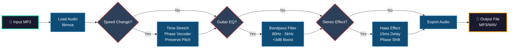

<div align="center">

# 🎸 slowmedown

### *Master Guitar Solos at Your Own Pace*

**AI-Powered Audio Processing for Musicians**

[](https://python.org)
[](LICENSE)
[](https://github.com)

---

</div>

## ✨ Features

<table>
<tr>
<td width="50%">

### 🎚️ Variable Speed Control
Slow down audio **without pitch distortion** using advanced phase vocoder technology. Perfect for learning fast solos note-by-note.

</td>
<td width="50%">

### 🎛️ Guitar Frequency Enhancement  
Boost the **80 Hz - 5 kHz range** to make guitar parts pop out of the mix. Hear every nuance clearly.

</td>
</tr>
<tr>
<td width="50%">

### 🔊 Mono-to-Stereo Magic
Transform flat mono tracks into rich **pseudo-stereo** soundscapes using Haas effect and phase manipulation.

</td>
<td width="50%">

### 💾 Multiple Export Formats
Save your processed tracks as high-quality **MP3 (320kbps)** or uncompressed **WAV** files.

</td>
</tr>
</table>

---

## 🔄 Audio Processing Pipeline



---

## 🚀 Installation

### Prerequisites
- **Python 3.12+**
- **FFmpeg** (required for MP3 support)

### Quick Setup

```bash
# 1. Install FFmpeg
sudo apt-get update && sudo apt-get install -y ffmpeg

# 2. Install Python dependencies
pip install -r requirements.txt

# 3. Make script executable (optional)
chmod +x slowmedown.py
```

---

## 💻 Usage

### 🎯 Quick Start

```bash
# Basic usage - slow to 75% speed
python slowmedown.py song.mp3 --speed 0.75

# Full power - slow + enhance + stereo
python slowmedown.py solo.mp3 -s 0.5 -g -st
```

### 📋 Command Reference

```bash
python slowmedown.py [INPUT_FILE] [OPTIONS]
```

| Option | Shorthand | Description | Default | Example |
|--------|-----------|-------------|---------|---------|
| `--speed` | `-s` | Playback speed factor | `1.0` | `-s 0.75` (75% speed) |
| `--enhance-guitar` | `-g` | Boost guitar frequencies | `off` | `-g` |
| `--stereo` | `-st` | Convert to pseudo-stereo | `off` | `-st` |
| `--output` | `-o` | Output file path | `input_slowed.mp3` | `-o practice.mp3` |
| `--format` | `-f` | Export format (mp3/wav) | `mp3` | `-f wav` |

---

## 🎼 Real-World Examples

### 🔥 Learning Eddie Van Halen's "Eruption"
```bash
python slowmedown.py eruption.mp3 --speed 0.6 --enhance-guitar --stereo -o practice.mp3
```
*Slows down to 60% speed, boosts guitar frequencies, adds stereo width*

### 🎵 Jazz Standards Practice
```bash
python slowmedown.py giant_steps.mp3 -s 0.7 -g -f wav
```
*70% speed with guitar enhancement, exported as WAV for maximum quality*

### ⚡ Shredding Practice (Minimal Processing)
```bash
python slowmedown.py solo.mp3 --speed 0.85
```
*Light slowdown to 85%, no additional processing*

### 🎸 Full Enhancement Suite
```bash
python slowmedown.py metallica.mp3 -s 0.5 -g -st -o master_of_puppets_practice.mp3
```
*50% speed, guitar boost, stereo effect - perfect for complex riffs*

---

## 🧠 How It Works

### 🔬 Technology Stack

| Component | Technology | Purpose |
|-----------|-----------|---------|
| **Pitch Preservation** | Librosa Phase Vocoder | Time-stretch without changing pitch |
| **Guitar EQ** | Scipy Bandpass Filter | Isolate and boost 80Hz-5kHz range |
| **Stereo Effect** | Haas Effect + Phase | Create spatial width from mono |
| **Audio I/O** | Pydub + Soundfile | Handle MP3/WAV import/export |

### ⚙️ Processing Details

- **Sample Rate**: Preserves original (typically 44.1kHz or 48kHz)
- **Bit Depth**: 32-bit float processing → 16-bit output
- **MP3 Quality**: 320kbps CBR (constant bitrate)
- **Normalization**: Automatic peak limiting to prevent clipping
- **Filter Order**: 4th-order Butterworth for smooth frequency response

### 📊 Frequency Response Curve

The guitar enhancement applies a gentle boost in the critical guitar range:

```
dB
 +3|     ___________
    |    /           \
  0 |___/             \___
    |
    0   80Hz    5kHz    20kHz
        └───────┬───────┘
           Guitar Range
```

---

## 🎯 Use Cases

- 🎓 **Learning Complex Solos** - Slow down without pitch shift
- 🎵 **Transcription Work** - Hear every note clearly with EQ boost
- 🔊 **Mono Track Enhancement** - Add stereo width to flat recordings
- 📝 **Music Education** - Create practice tracks for students
- 🎸 **Cover Band Rehearsal** - Match performance tempo gradually

---

## 🛠️ Advanced Usage

### Batch Processing
```bash
# Process multiple files
for file in *.mp3; do
    python slowmedown.py "$file" -s 0.75 -g -st
done
```

### Pipeline Integration
```bash
# Chain with other tools
python slowmedown.py input.mp3 -s 0.8 -f wav -o temp.wav
# ... further processing with other tools
```

---

## 📦 Dependencies

| Package | Version | Purpose |
|---------|---------|---------|
| `librosa` | ≥0.10.0 | Audio analysis & time-stretching |
| `pydub` | ≥0.25.1 | MP3 encoding/decoding |
| `soundfile` | ≥0.12.1 | WAV file I/O |
| `numpy` | ≥1.24.0 | Numerical operations |
| `scipy` | ≥1.10.0 | Signal processing filters |
| `click` | ≥8.1.0 | CLI interface |

---

## 🐛 Troubleshooting

### FFmpeg Not Found
```bash
# Ubuntu/Debian
sudo apt-get install ffmpeg

# macOS
brew install ffmpeg

# Check installation
ffmpeg -version
```

### Memory Issues with Large Files
- Try processing in WAV format first
- Reduce sample rate if needed
- Process shorter segments

---

## 📝 License

MIT License - feel free to use for any purpose!

---

<div align="center">

### 🌟 Made with ❤️ for guitarists by guitarists

**[Report Bug](https://github.com/masseo1/mono2better/issues)** • 
**[Request Feature](https://github.com/masseo1/mono2better/issues)** • 
**[Contribute](https://github.com/masseo1/mono2better/pulls)**

</div>
